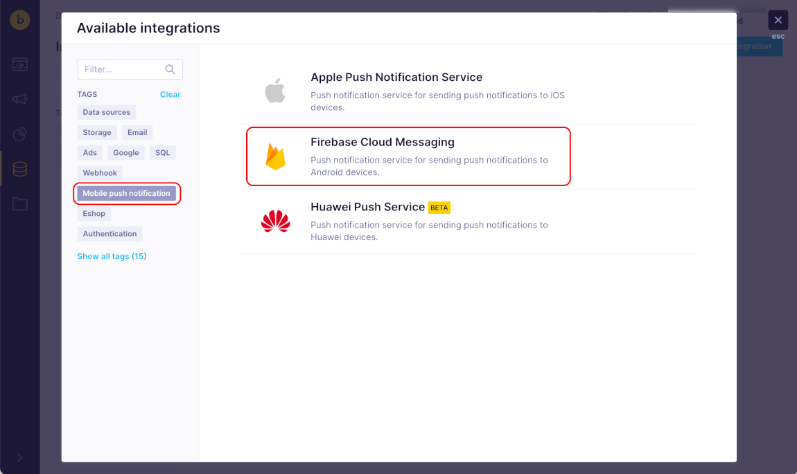

# Exponea web app push notification configuration

  1. Go to your project's Firebase Console and navigate to Project Settings using cog icon

  

  2. Open **Cloud Messaging Tab**

  

  3. Locate **Server Key** property, thats your Firebase Cloud Messaging API Key, which you will setup in **Exponea Web app**

  

  5. Go to [Exponea Web App](https://app.exponea.com), login and navigate to `Project Settings`

  

  6. Navigate to `Channels->Push notifications`. Locate `Firebase Cloud Messaging integration` section and click `Integration section link`

  

  7. Click to `Add new integration`

  

  8. Choose `Firebase Cloud Messaging` from options. Feel free to use `Mobile push notification` tag to filter options.

  

  9. Locate `API key` input field and pass value you have copied from **Firebase** and click `Save integration`

  

  10. Navigate back to `Channels->Push notifications` in project settings. Now you are able to choose an option `Firebase Cloud Messaging` in `Firebase Cloud Messaging integration` section

  

  7. Save Changes
