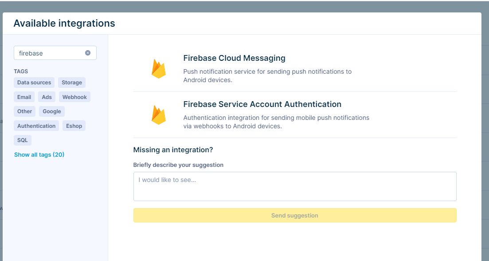
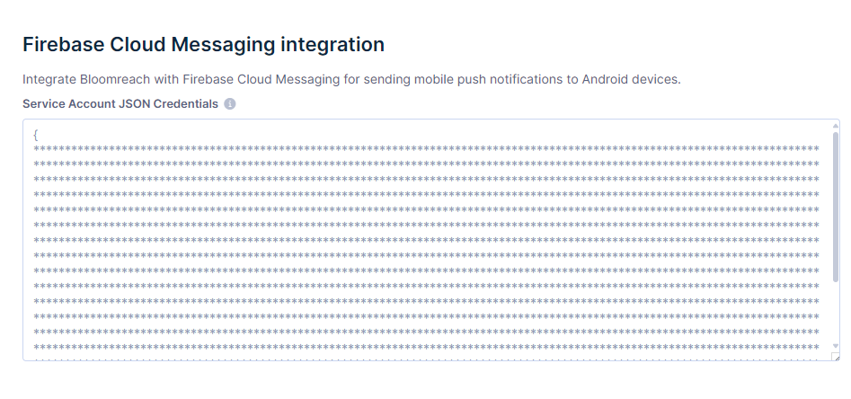

# Bloomreach Engagement - Firebase Push Notifications setup

This document describes how Firebase can be set up in the Bloomreach Engagement web application in order to be used for sending push notifications.

The setup requires you to use a private key from a Service Account that you create in Google Cloud and then copy-paste that key into the integration authentication in Bloomreach Engagement.

Follow the steps below:

1. **Create a service account.** To create a new service account in Google Cloud, go to `Service Accounts`, then choose your project. On the Service Accounts page, select `Create Service Account`. It is possible to use roles to define more granular access.

2. **Generate new Private Key**. Locate the FCM service account you created in step 1, then select `Actions` > `Manage Keys`. Select `Add Key` > `Create new key`. Download the JSON key file.

3. **Add Firebase Cloud Messaging integration** to your Engagement project. Go to `Data & Assets` > `Integration`. Click on `Add new integration` and select `Firebase Cloud Messaging` for sending push notifications via the push notification node. Please note that if you’d like to send Push Notifications via webhooks, you must select `Firebase Service Account Authentication`.

4. **Insert the key from step 2** into the Firebase Cloud Messaging integration settings page in Bloomreach Engagement in `Service Account JSON Credentials`. 

5. **Set this integration** in `Project Settings` > `Channels` > `Push notifications` > `Firebase Cloud Messaging integration`, so that this integration can be used to send push notifications for Android devices via the push notification node.

