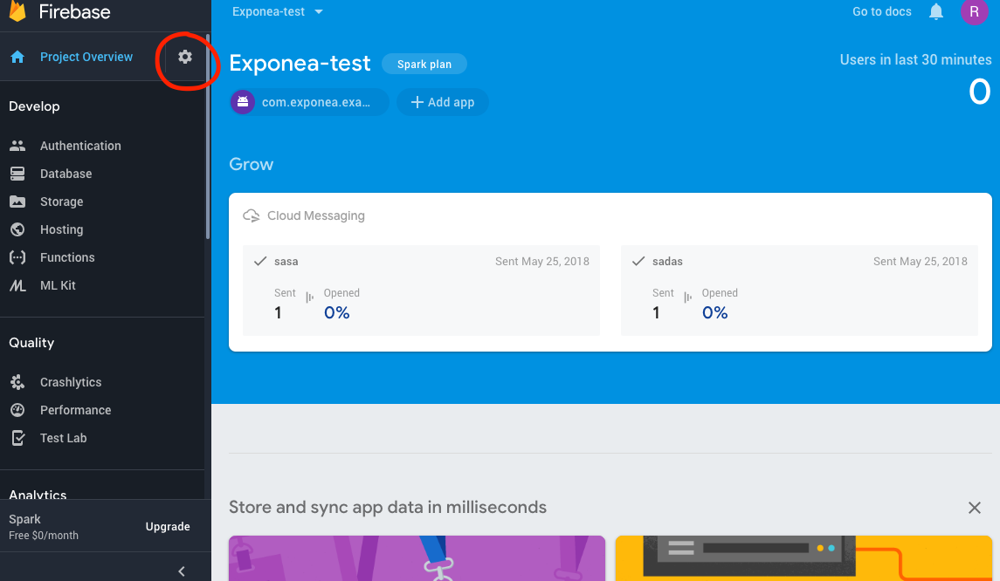
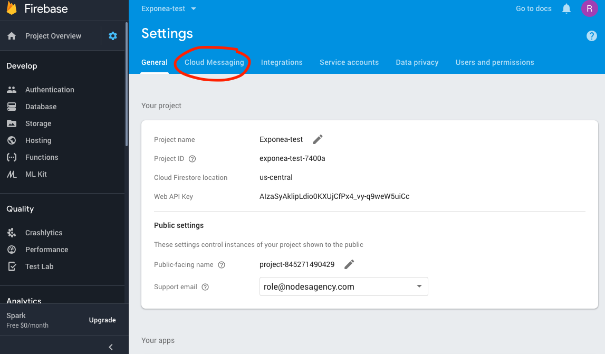
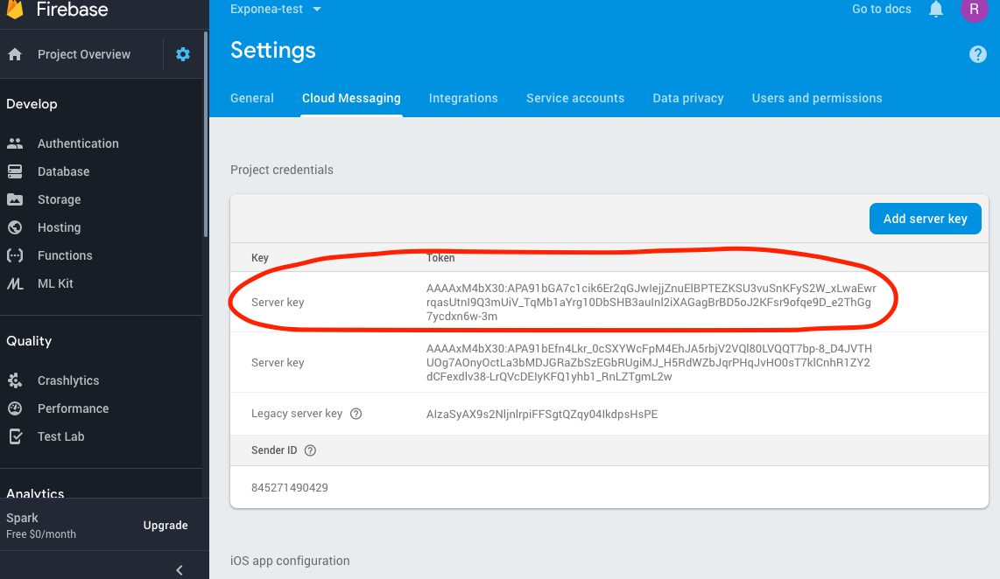
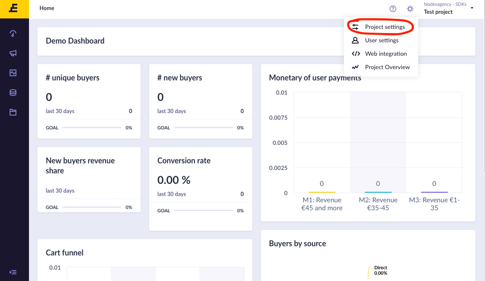
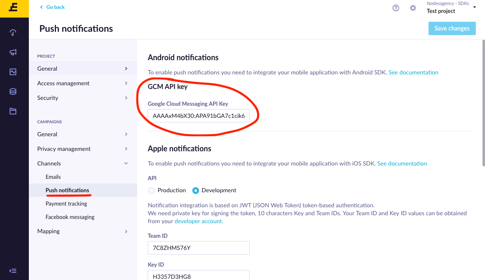

# Exponea web app push notification configuration

  1. Go to your project's Firebase Console and navigate to Project Settings using cog icon

  

  2. Open **Cloud Messaging Tab**

  

  3. Locate **Server Key** property, thats your Firebase Cloud Messaging API Key, which you will setup in **Exponea Web app**

  

  5. Go to [Exponea Web App](https://app.exponea.com), login and navigate to Project Settings

  

  6. Navigate to `Channels->Push notifications`. Locate FCM API Key input field and
  pass value you have copied from **Firebase**

  

  7. Save Changes
