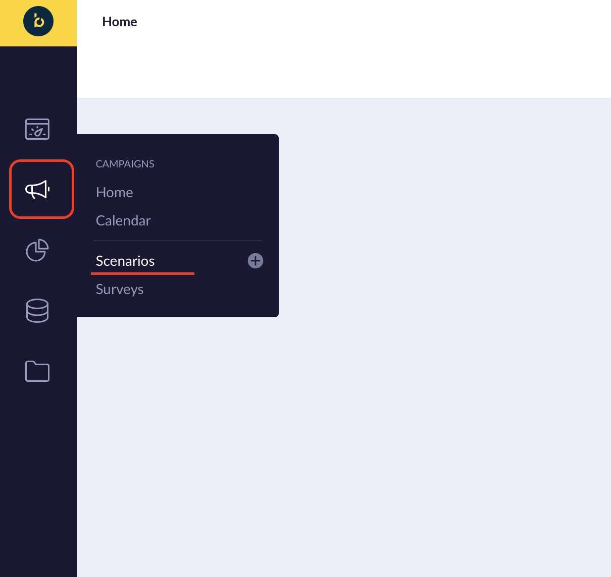
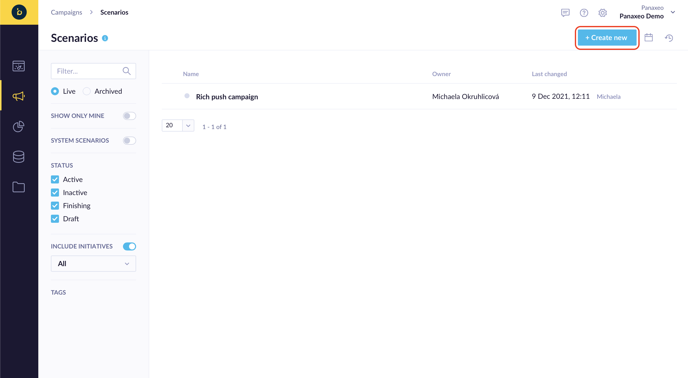
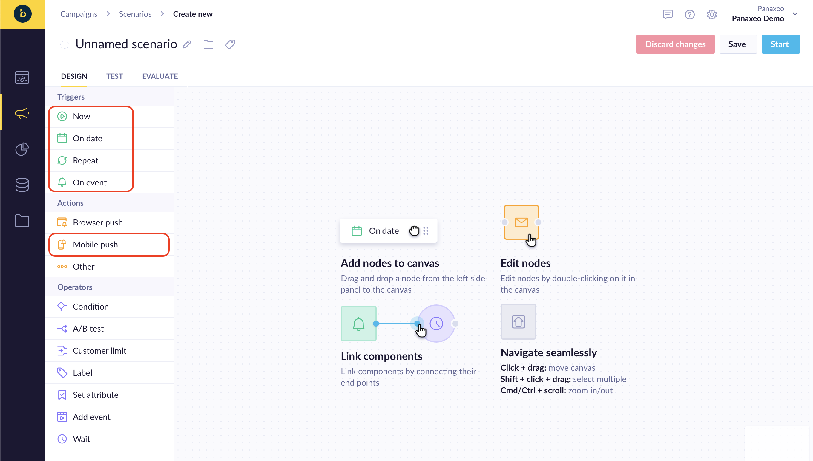

# Sending & Handling Push notifications


## Payload constructing
Exponea web app provides great notifications builder, where you can customize all the interaction and how it will be presented to users

1. First open Exponea Web App and choose **Campaigns->Scenarios** from the left menu

  

2. To create new Campaign, prees **Create new** button

  

3. This will open a **Campaign Builder** where you can specify when/how your push notification is triggered
You will need to choose a trigger and action type. To locate mobile push notification action
use **Actions->Others** and choose **Mobile Push Notifications** in pop-up menu

  

  


4. This will open notification builder. There you can specify **Title** (1) and **Message** (2) for your notification. There is a **Preview** (4) on the right side that will show the notification is gonna look like. There is also an option to specify an **Image (6)** you want to display and **Sound (9)** that will be played when notification is received.

> When specifying the sound, provide sound name without extension


5. You can also specify what kind of **Interaction** you want handle when user is clicking on that notification (3). There are 3 options available:
  * Open Application
  * Open Browser
  * Open Deeplink

  

6. Additionally you can specify more **Interactions** by Pressing **Add Action button (8)**


8. Lastly, you can specify additional **Data** you want to send using key-value pairs


## Payload handling

By default Exponea will automatically handle interactions you've provided in **Payload Builder**. You need only to provide valid URL for browser interaction and a URI for **Deep link** like so:


You can change this behavior by changing the `isAutoPushNotification` flag. In that case you'll have to manually handle payloads on your own `FirebaseMessagingService` implementation. If you're handling it manually and still want to Exponea to show the notification, you can use `Exponea.handleRemoteMessage()` method.

### Deep link Handling

Android's deeplinks allow you to trigger specific actions on your app. Exponea SDK notifications can handle deeplink for you, but your application must be ready to receive them.

To handle a deeplink first add the desired host and scheme to your `AndroidManifest.xml`:
```xml
<activity ...>
   <intent-filter>
       <action android:name="android.intent.action.VIEW" />
       <category android:name="android.intent.category.DEFAULT" />
       <category android:name="android.intent.category.BROWSABLE" />

        <!-- Accepts URIs that begin with "exponea://action”-->
        <data android:scheme="exponea" android:host="action" />

        <!-- Accepts URIs that begin https://www.example.com -->
        <data android:scheme="https" android:host="www.example.com" />
   </intent-filter>
</activity>
```
When firing a notification the same host and scheme must be used.

When the deeplink is triggered, your activity can receive the data and handle it accordingly. This can be done for example in Activity's `onCreate()` method

```
if (getIntent() != null) {

   // The deeplink you've sent
   val data : Uri = getIntent().data
   if (data != null) {

      // do something with the deeplink
      Toast.makeText(this, "Deeplink received: $data", Toast.LENGTH_SHORT).show()
   }
}
```
More info about deeplinks can be found in the Google official docs [here](https://developer.android.com/training/app-links/deep-linking).
